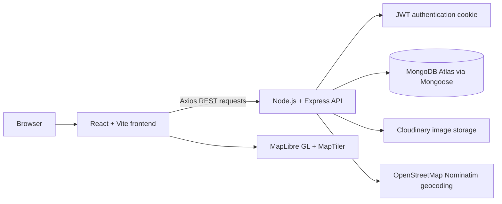

# StayFinder

StayFinder is a React and Node.js web application for discovering and sharing travel destinations. Users can browse approved listings, filter them by state, view location details on a map, and sign in to create listings, like destinations, submit reviews, and manage their profile.

## Live Demo

[Open the StayFinder live application](https://stay-finder-beta.vercel.app/)

- GitHub: [Yash-Agarwall/StayFinder](https://github.com/Yash-Agarwall/StayFinder)
- Backend: [stayfinder-x0bv.onrender.com](https://stayfinder-x0bv.onrender.com)

## Features

- Browse approved destination listings with pagination and a responsive card grid.
- Filter listings by state and search destinations through the frontend navigation.
- View listing details including the description, host, price, rating, image, likes, and approved reviews.
- View listing coordinates on an interactive MapTiler map with streets, satellite, and hybrid styles.
- Create listings with title, description, price, location, state, country, category, and an image upload.
- Automatically geocode a listing location through OpenStreetMap Nominatim when a listing is created.
- Edit or delete listings when the signed-in user owns them.
- Send new and edited listings for administrator approval before they are shown publicly.
- Like and unlike listings for authenticated users.
- Submit 1-to-5-star reviews and comments; reviews remain pending until approved by an administrator.
- Delete reviews when the authenticated user is the review author.
- Sign up, log in, log out, and restore the current user from an HTTP-only authentication cookie.
- Edit a profile full name and upload a profile image with a 3 MB limit.
- Admin dashboard with listing and review statistics, pending queues, approval, rejection, and bulk listing approval.

## Tech Stack

### Frontend

- React 19 and React DOM
- Vite
- React Router DOM
- Axios for REST API requests
- Tailwind CSS through the Vite plugin
- MapLibre GL for maps
- GSAP and ScrollTrigger for page and listing animations
- Lucide React, React Hot Toast, and Starability for UI interactions

### Backend

- Node.js
- Express
- CommonJS modules
- Multer with `multer-storage-cloudinary` for multipart listing image uploads
- Joi and the repository validation utilities for request validation
- Compression, CORS, cookie-parser, and dotenv

### Database

- MongoDB Atlas
- Mongoose
- Connect-Mongo for the Express session store

### Authentication/Security

- JSON Web Tokens (`jsonwebtoken`)
- HTTP-only cookies
- `bcrypt` password hashing and comparison
- Express sessions and secure cross-site cookie settings in production
- Middleware for authentication, listing ownership, review authorship, and administrator roles

### Cloud/Third-party Services

- Cloudinary for listing and profile image storage
- MapTiler styles consumed by MapLibre GL
- OpenStreetMap Nominatim for listing-location geocoding

### Deployment

- Frontend: Vercel
- Backend: Render
- Database: MongoDB Atlas
- Images: Cloudinary

## Architecture

StayFinder is organized as two applications. The Vite-built React frontend communicates with the Node.js/Express backend through Axios and REST endpoints. The backend uses Mongoose models for MongoDB persistence, JWT cookies for API authentication, Cloudinary for uploaded images, and external geocoding and map services for location data.



The production frontend uses the `VITE_API_URL` Axios base URL and sends credentials with requests. In local development, the frontend defaults to `http://localhost:8000/api`; the backend enables CORS for the local Vite ports and the configured production frontend URL.

## Authentication & Authorization

1. Signup hashes the submitted password with `bcrypt`, creates a user with the default `user` role, signs a JWT, and sets an HTTP-only `token` cookie.
2. Login verifies the email and password, rejects banned users, signs a JWT containing the user ID, role, and email, and sets the cookie for three days.
3. Protected backend middleware reads the JWT from `req.cookies.token`, verifies it with `JWT_SECRET`, and places the decoded user data on `req.user`.
4. The React `AuthContext` calls `/auth/current_user` on startup and keeps the current user in application state and `localStorage` for UI persistence. The cookie remains the server-side authentication credential.
5. Listing creation, editing, deletion, likes, reviews, profile changes, and current-user access require authentication where defined by the routes.
6. Listing updates and deletion require listing ownership. Review deletion requires review authorship.
7. Admin endpoints require both a valid JWT and `req.user.role === "admin"`.

In production, authentication cookies are configured as `httpOnly`, `secure`, and `sameSite: "none"` so the separately deployed frontend and backend can communicate with credentials. No secret values are stored in this README.

## Main Application Flow

1. A visitor opens the home or listings view and loads approved listings from the API.
2. The visitor filters the collection by state, opens a listing, and views its details and map location.
3. A user signs up or logs in. The frontend restores the authenticated user through the current-user endpoint.
4. An authenticated user submits a listing with an image. The backend uploads the image, geocodes the location, stores the listing as `pending`, and returns an approval message.
5. The listing owner can edit or delete the listing. An edit sends the listing back to pending review.
6. An authenticated user can like a listing or submit a rating and comment. New reviews are pending until moderation.
7. An administrator reviews pending listings and reviews, then approves or rejects them from the admin dashboard.

## API Overview

All endpoints below are prefixed by the backend API base path. The review router is mounted at `/api/listing/:id/reviews` while listing routes are mounted at `/api/listings`.

| Method   | Endpoint                                   | Purpose                                                                 | Authentication         |
| -------- | ------------------------------------------ | ----------------------------------------------------------------------- | ---------------------- |
| `POST`   | `/api/auth/signup`                         | Create a user and set a JWT cookie                                      | Public                 |
| `POST`   | `/api/auth/login`                          | Verify credentials and set a JWT cookie                                 | Public                 |
| `GET`    | `/api/auth/logout`                         | Clear the JWT cookie                                                    | Public                 |
| `GET`    | `/api/auth/current_user`                   | Return the authenticated user                                           | Required               |
| `PATCH`  | `/api/auth/profile?op=name` or `?op=image` | Update profile name or image                                            | Required               |
| `GET`    | `/api/listings`                            | List approved listings; supports `state`, `page`, `limit`, and `offset` | Public                 |
| `GET`    | `/api/listings/states`                     | Return available listing states                                         | Public                 |
| `POST`   | `/api/listings`                            | Create a pending listing with an image upload                           | Required               |
| `GET`    | `/api/listings/:id`                        | Return one listing with its owner and approved reviews                  | Public                 |
| `PUT`    | `/api/listings/:id`                        | Update an owned listing and resubmit it for review                      | Owner required         |
| `DELETE` | `/api/listings/:id`                        | Delete an owned listing                                                 | Owner required         |
| `POST`   | `/api/listings/:id/like`                   | Like or unlike a listing                                                | Required               |
| `POST`   | `/api/listing/:id/reviews`                 | Submit a pending review                                                 | Required               |
| `DELETE` | `/api/listing/:id/reviews/:reviewId`       | Delete an authored review                                               | Review author required |
| `GET`    | `/api/admin/stats`                         | Return listing and review counts                                        | Admin required         |
| `GET`    | `/api/admin/pending`                       | List pending listings                                                   | Admin required         |
| `PATCH`  | `/api/admin/approve/:id`                   | Approve one listing                                                     | Admin required         |
| `PATCH`  | `/api/admin/approve-all`                   | Approve all pending listings                                            | Admin required         |
| `DELETE` | `/api/admin/reject/:id`                    | Reject and remove one listing                                           | Admin required         |
| `GET`    | `/api/admin/pending-reviews`               | List pending reviews                                                    | Admin required         |
| `PATCH`  | `/api/admin/reviews/approve/:id`           | Approve one review                                                      | Admin required         |
| `DELETE` | `/api/admin/reviews/reject/:id`            | Reject and remove one review                                            | Admin required         |

## Project Structure

```text
StayFinder/
├── backend/
│   ├── app.js
│   ├── cloudConfig.js
│   ├── package.json
│   ├── seed.js
│   ├── data/data.js
│   └── src/
│       ├── config/connectDB.js
│       ├── controllers/
│       │   ├── auth/
│       │   ├── user/
│       │   ├── listings.js
│       │   └── review.js
│       ├── errors/AppError.js
│       ├── middlewares/
│       │   ├── middleware.js
│       │   └── validations/
│       ├── models/
│       │   ├── listing.js
│       │   ├── review.js
│       │   └── user.js
│       ├── routes/
│       └── utils/
├── frontend/
│   ├── index.html
│   ├── package.json
│   ├── vite.config.js
│   ├── vercel.json
│   └── src/
│       ├── api.js
│       ├── App.jsx
│       ├── components/
│       ├── context/AuthContext.jsx
│       ├── pages/
│       └── main.jsx
├── Docs/
└── README.md
```

## Local Development

Node.js and npm are required. Install dependencies and run each application from its own directory.

### Backend

```bash
cd backend
npm install
npm run dev
```

The backend development script runs `nodemon app.js` and listens on port `8000` unless `PORT` is set. The production script is `npm start`.

### Frontend

```bash
cd frontend
npm install
npm run dev
```

The frontend development script runs Vite. Its local Axios base URL is `http://localhost:8000/api`.

To create and preview a production frontend build:

```bash
npm run build
npm run preview
```

## Environment Variables

Create a backend `.env` file locally. Do not commit it.

### Backend: `backend/.env`

```env
ATLASDB_URL=your_mongodb_connection_string
SECRET=your_session_secret
JWT_SECRET=your_jwt_secret
FRONTEND_URL=http://localhost:5173
CLOUD_NAME=your_cloudinary_cloud_name
CLOUD_API_KEY=your_cloudinary_api_key
CLOUD_API_SECRET=your_cloudinary_api_secret
PORT=8000
NODE_ENV=development
```

`ATLASDB_URL`, `SECRET`, `JWT_SECRET`, `FRONTEND_URL`, and the three Cloudinary variables are read by the backend. `PORT` and `NODE_ENV` are also read when configuring the server, cookies, CORS, and dotenv behavior.

### Frontend: `frontend/.env`

```env
VITE_API_URL=https://stayfinder-x0bv.onrender.com/api
VITE_MAPTILER_API_KEY=your_maptiler_api_key
```

`VITE_API_URL` is used as the production Axios base URL. `VITE_MAPTILER_API_KEY` is used to load MapTiler streets, satellite, and hybrid styles. Vite exposes `VITE_` variables to the browser, so only use a client-safe map key there.

## Deployment

The deployed setup is split across the following services:

- Frontend: Vercel at [stay-finder-beta.vercel.app](https://stay-finder-beta.vercel.app/)
- Backend: Render at [stayfinder-x0bv.onrender.com](https://stayfinder-x0bv.onrender.com)
- Database: MongoDB Atlas, connected through `ATLASDB_URL`
- Images: Cloudinary, configured through the backend Cloudinary credentials

The frontend includes a Vercel rewrite so client-side routes resolve to `index.html`. The backend uses the configured `FRONTEND_URL` for credentialed CORS requests from the deployed frontend.

## Security Considerations

- Secrets and connection strings are supplied through environment variables rather than committed source files.
- The root and frontend `.gitignore` files exclude `.env` files and dependency/build output.
- Passwords are hashed with `bcrypt` before they are stored.
- JWTs are stored in HTTP-only cookies and verified by protected backend middleware.
- Ownership and review-author checks prevent unrelated authenticated users from modifying protected resources.
- Admin routes require the authenticated user's `admin` role.
- Uploaded listing images are restricted to PNG/JPG/JPEG formats by the Cloudinary storage configuration; profile images are validated and limited to 3 MB in the profile flow.

## Future Improvements

- Add automated backend and frontend tests for authentication, ownership, moderation, likes, and review flows.
- Add centralized error handling and consistent response schemas across all API routes.
- Complete and connect the host-profile flow, which is currently represented by an unfinished frontend screen without a corresponding backend route.
- Add listing management views so users can see their own pending, approved, and rejected submissions.
- Add pagination metadata and clearer loading/error states to the listing and moderation views.
- Add rate limiting, stronger input validation, and production observability for public API endpoints.

## Author

Yash Agarwal

GitHub: [Yash-Agarwall](https://github.com/Yash-Agarwall)
